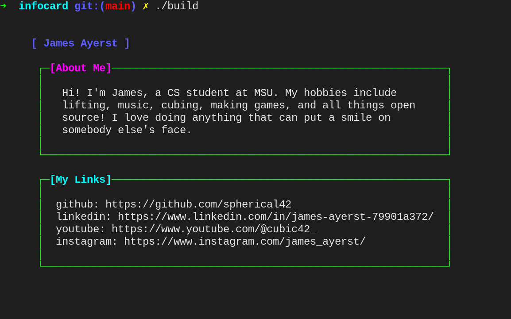

# Terminal Info Card Generator

A very simple bash tool to generate a pretty, terminal-servable text file with your information.

## Usage

Add your information in plain text files and build script then run ./build

 
